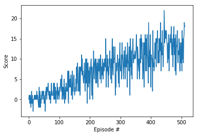

## Learning Algorithm

The learning algorithm implemented here is Deep Q Learning with a 2-Layer, 128 node, fully-connected neural network using a mean-squared error loss function. A replay buffer is also used to take advantage of previous experience. After some experimentation with various learning rates, the best results were achieved with a learning rate of .0003. The replay buffer was set at 100000, the batch size at 64, gamma at .99, TAU at .001, with the network updated every 4 steps. Epsilon decay is set to .995 with a minimum of 0.1 and starting at 1.0.

These settings resulted in the agent converging after 412 episodes. The graph of score over episodes is below.

During the course of experimentation, made the following changes to try to get better results. The experiments that converged can be found in the OtherCheckpoints directory: Learning rate changes-Tried .0002, .0003, .0004 and .0005 Neural Net Changes-Experimented with 3 Layer instead of 2 Layer (model in folder) Batch Size-Tried 128 and 32 in addition to 64. Agent seed-Tried 0 for agent's seed Loss functions-Poisson NLL Loss and Cross Entropy

## Ideas for Future Work

This could possibly be improved by implementing either the double deep q learning algorithm or prioritized experience replay or a combination of both.
